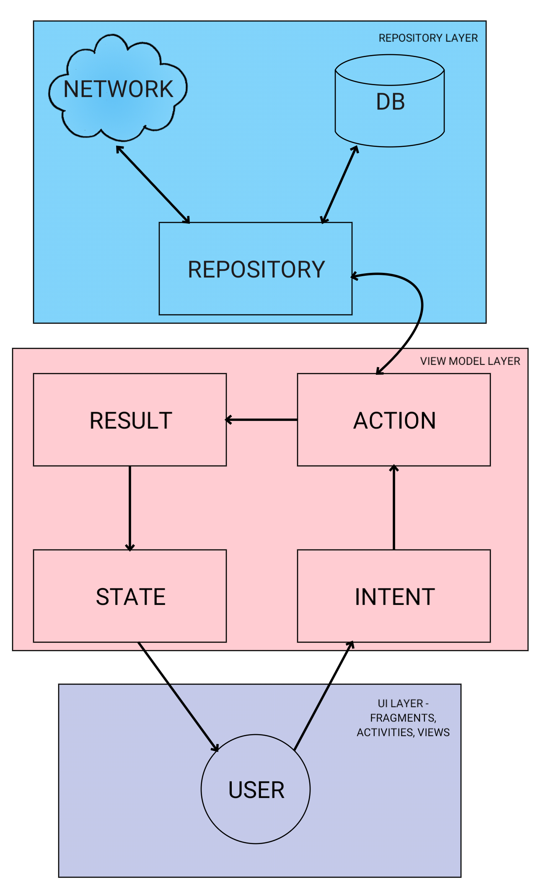

# PostDashboard

A simple project used to illustrate clean architecture and testing in Android with Kotlin.

The app shows a list of posts from [JsonPlaceholder](http://jsonplaceholder.typicode.com). Upon tapping on one of the posts, a detail view is shown with further details on the tapped post.

## Architecture

The hastily drawn diagram above illustrates how the Architecture for the App works. Essentially this is a slimmed down version of [MVI](https://www.youtube.com/watch?v=64rQ9GKphTg).

In essence there are three layers: UI, View Model, and Repository. Users send an `Intent` through the View Model layer which are later emitted by a `State`. The `State` is emitted via a `LiveData`, and is all the UI layer needs to do is observe it in order to figure out what to display.

The View Model layer is (importantly) unidirectional, and takes intents, maps them to actions, performs the actions, and returns results. Those results are finally mapped to the `State`.

These mappings occur in an `Interpreter` which exists in each step along the way. For example, the `ActionInterpreter` which takes an `Action` and produces a `Result`.

The Repository layer contains a `Repository` which is the logic of how the app gets data. Data is initially loaded from the network, but subsequently saved to a Database until that data is no longer viable. At the present there is no invalidation logic.

The UI layer is an Activity with multiple fragments - but in this app it is pretty bare bones. I decided to concentrate heavily on the Architecture as I was left pretty inspired by Droidcon London 2018 - where many of the talks involved Architecture and structuring the app in a clean way. I figured this would be a good way to put theory into practice.

## Installing and Testing

The app can be run and installed easily from Android Studio. The instructions below are for running it via the command line.

### Running the app via the command line

Run the following command in the repository's directory:

    ./gradlew installDebug

If a device is connected, the app should run without a problem.

### Running the Espresso tests via the command line

Similarly, run the following command:

    ./gradlew connectedAndroidTest

### Running the unit tests via the command line

Unit tests work the same way:

    ./gradlew test

## Built With

* [Kotlin](https://kotlinlang.org/)
* [Lifecycle](https://developer.android.com/topic/libraries/architecture/lifecycle)
* [LiveData](https://developer.android.com/topic/libraries/architecture/livedata)
* [ViewModel](https://developer.android.com/topic/libraries/architecture/viewmodel)
* [Mockito](https://site.mockito.org/)
* [RecyclerView](https://developer.android.com/reference/android/support/v7/widget/RecyclerView)
* [Retrofit](https://square.github.io/retrofit/)
* [Room](https://developer.android.com/topic/libraries/architecture/room)
* [ConstraintLayout](https://developer.android.com/reference/android/support/constraint/ConstraintLayout)
* [Koin](https://github.com/InsertKoinIO/koin)
* [Mockito-Kotlin](https://github.com/nhaarman/mockito-kotlin/wiki)
* [Espresso](https://developer.android.com/training/testing/espresso/)
* [Navigation Architecture Component](https://developer.android.com/topic/libraries/architecture/navigation/)
* [Coroutines](https://kotlinlang.org/docs/reference/coroutines-overview.html)

## License

 

Copyright (C) 2018 Boris Kachscovsky

This program is free software: you can redistribute it and/or modify it under the terms of the GNU General Public License as published by the Free Software Foundation, either version 3 of the License, or (at your option) any later version.

This program is distributed in the hope that it will be useful, but WITHOUT ANY WARRANTY; without even the implied warranty of MERCHANTABILITY or FITNESS FOR A PARTICULAR PURPOSE. See the GNU General Public License for more details. You should have received a copy of the GNU General Public License along with this program. If not, see http://www.gnu.org/licenses/.